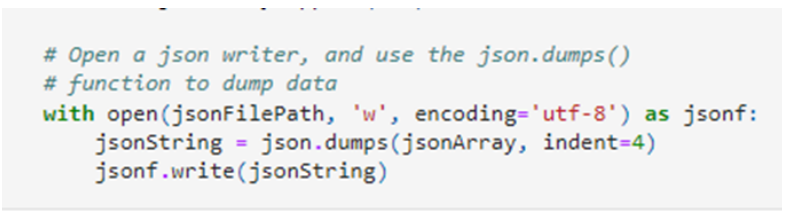
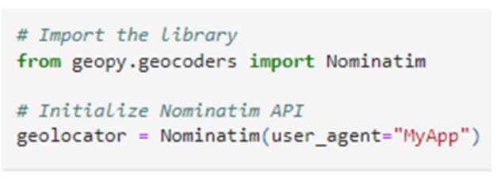
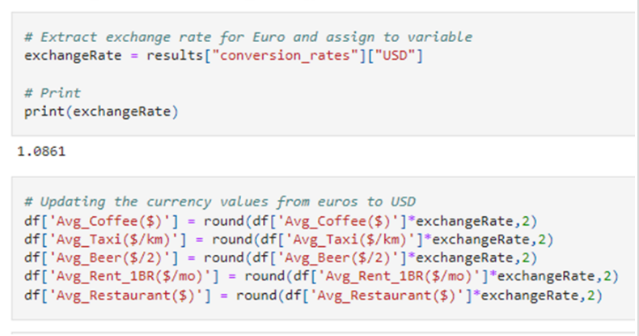
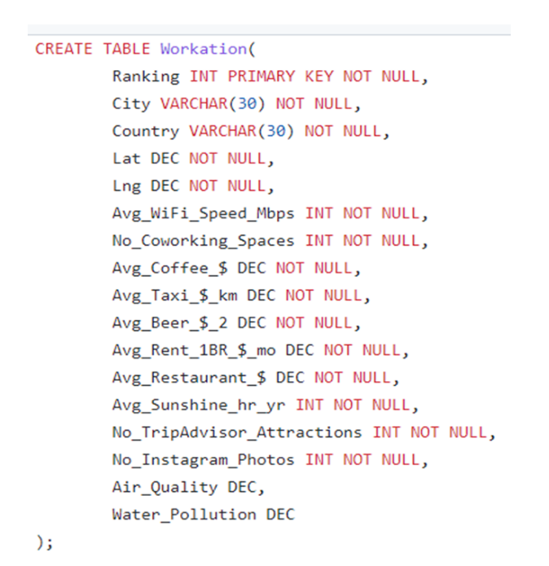

# Project_3: Best Cities for Workation
 This project analyzes the best cities for a workation. This is determined by comparing expenses and amenities across 148 cities.
Data:
The data was obtained from https://www.kaggle.com/datasets/prasertk/the-best-cities-for-a-workation?resource=download and https://www.kaggle.com/datasets/cityapiio/world-cities-air-quality-and-water-polution
 
Objectives:
1. The top cities for workation based on expense versus amenities. Expenses include food, accommodation, taxi, drinks and coffee. Amenities include Wi-Fi, workspace, and climate.
2. Best cities in terms of travel (tourist attractions and Instagrammability) vs work resources availability
 
Technologies Used:
HTML/CSS
Javascript
SQL
Jupyter Notebook
Leaflet
Plotly
JQuery
ApexCharts
Pandas
Python
MongoDB
Geopy
ExchangeRate-API

ETL:
We used Jupyter notebook to import and clean up the data. We used JSON library to initially import and clean and convert our data from csv.

Then used Geopy library and API to get the latitude and longitude for each the cities.

After that used Pandas to create and manipulate our Cities dataframe.

After that we used currency exchange API to convert all currency data to Dollar from Euros

After that we imported pollution dataframe which was then merged into our cities dataframe. Then the merged dataframe was saved as CSV and Json files for further analysis.
 
SQL:
We also used Postgres to create a "Workation" table with 17 columns. Ranking was used as the primary key.

Visualizations:
We used Javascript and HTML to create visualizations.
We used leaflet to create the map html for out analyzed cities - https://simpelaki.github.io/project_3/
Then we used Apex charts and Plotly libraries to create bar, bubble and gauge charts -
https://simpelaki.github.io/project_3/dashboard.html

Data Analysis:
We used Jupyter notebook to analyze data. We analyzed total cost across cities.
 
Room for improvement:
- We can do statistical testing to prove the amenities in the top 10 cities are significantly different than the bottom 10 cities. Similar testing can be done with regards to expenses.
 
 